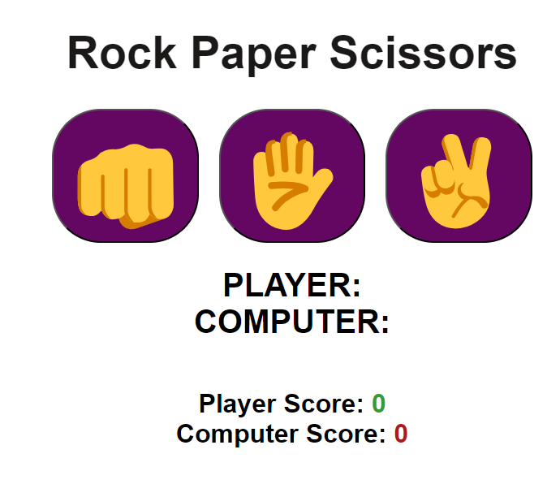

# 03-Rock-Paper-Scissors
A game of rock, paper, scissors created using JavaScript. Enjoy!

## Description

This is a super basic game of Rock, Paper, Scissors. I followed a tutorial (link below) to create this game. I'm just beginning to learn JavaScript and this tutorial taught me a lot about how to use the html, css, and script files to create a cohesive site. The order of operations (first create the html, then add some css, then add functionality with script) was very well executed and demonstrated a step by step, logical process for creating functional web pages. I used the switch method for the first time too! I need to return to the CSS to make the game responsive. 

You can play here: https://sinclairems.github.io/03-Rock-Paper-Scissors/

## Usage

This game should be pretty easy to play: Just click on the Rock, Paper, or Scissors button!

## Credits

I completed this awesome YouTube tutorial:

https://www.youtube.com/watch?v=3uKdQx-SZ5A&t=917s

## License

See LICENSE file for details. 

